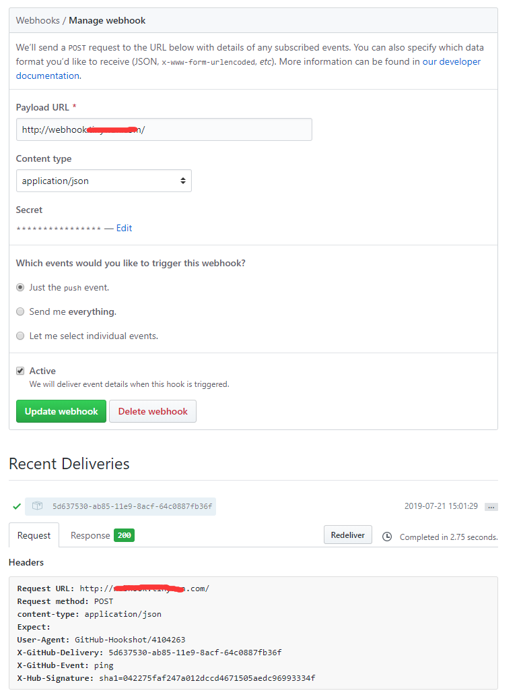

#  一个简单的webhooks


### 拉去代码

```shell
git clone https://github.com/Tinywan/webhooks.git
```

### Nginx 配置

```nginx
server {
    server_name  www.webhook.com;
    root /var/www/webhooks;
    location ~ \.php$ {
        fastcgi_pass   unix:/var/run/php-fpm.sock;
        fastcgi_index  index.php;
        fastcgi_param  SCRIPT_FILENAME  $document_root$fastcgi_script_name;
        include        fastcgi_params;
        fastcgi_buffer_size 128k;
        fastcgi_buffers 4 256k;
        fastcgi_busy_buffers_size 256k;
        fastcgi_connect_timeout 10000;
        fastcgi_send_timeout 6000;
        fastcgi_read_timeout 6000;
    }
}
```
> 保证改地址可以正常访问：http://www.webhook.com

### 配置[Github hooks](https://github.com/Tinywan/webhooks/settings/hooks)

  
